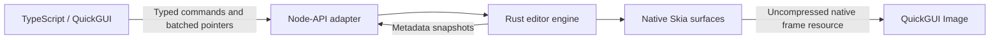

# UI in TypeScript, engine in Rust

Accepted user requirement, 2026-09-23. Implemented for the existing editor features. This does not imply full Compositor feature parity.

## Ownership

| Responsibility                                                                  | Implementation         |
| ------------------------------------------------------------------------------- | ---------------------- |
| QuickGUI views, controls, dialogs, shortcuts, accessibility, display formatting | TypeScript             |
| Transient forms, focus and open panels                                          | TypeScript             |
| Native loading, generated types, batched input, metadata subscriptions          | Thin TypeScript bridge |
| Documents, layers, masks, selection, edit transactions, undo/redo               | Rust                   |
| Document geometry, transforms, brushes, filters, compositing, pixel caches      | Rust                   |
| Image codecs, project validation, imports, atomic saves, exports                | Rust                   |

Rust is authoritative. The UI receives metadata with image contents and brush point arrays removed. It cannot set assets or strokes through a property patch. Opening a picker belongs to the UI; decoding the selected file belongs to Rust. Canvas-size form calculations remain transient UI state; Rust validates and applies the actual resize. `@napi-rs/canvas` is a development dependency used only for independent pixel checks and icon tooling.

## Runtime boundary



`crates/picsie-core` has no dependency on JavaScript or QuickGUI. `crates/picsie-native` owns one engine per window and exposes Node-API through napi-rs. The addon is tested in Node and Bun. A static CommonJS loader lets Bun embed it in the packaged executable; no working-directory dependency or external JS engine fallback exists.

Rust model/command types generate `src/engine/types.ts` through `ts-rs`. napi-rs generates `native-api.d.ts`, including async return contracts declared on the Rust exports. Regenerate with `npm run build:native`; do not hand-edit these files. Pointer moves are batched for up to 8 ms; down/up/cancel and subsequent commands flush queued samples. Each gesture commits one Rust history transaction.

Rendering, image import, canvas resize, file parsing, saves, exports and color sampling run in Node-API worker tasks. A save carries its captured revision, so later edits remain dirty. Imports reject a changed document revision instead of applying stale decoded results. Closing a window releases its native owner, rejects outstanding results, and frees surfaces and frame resources after the last worker finishes. No image bytes or per-pixel calls cross JavaScript.

## Preview transport and its limits

QuickGUI 0.1.6's public `Image` node accepts an image source string. Its raw `ImageSource` API is for native window/system icons, not the canvas view, and the extension ABI has no public shared-texture primitive. The current integration therefore publishes **32-bit uncompressed TIFF frame buffers from Rust**, then sends only the path to QuickGUI's native image loader.

On Linux the private temporary directory uses `/dev/shm` when available; other systems use their temporary directory. Up to eight recent frame resources are retained per window and deleted on close. Each resource has a unique path, avoiding stale native image caches. Preview backgrounds are opaque; PNG exports still preserve transparency.

This is not zero-copy GPU sharing. Skia reads pixels into a native buffer, the resource is written, and QuickGUI loads/uploads it. There is no PNG compression, base64, or JS pixel-array handoff in this path. At 936×734 a frame occupies 2,748,096 pixel bytes, plus a small TIFF header. This is a compatibility integration with a real native copy cost; replacing it with a future QuickGUI shared-texture API remains a performance improvement, not permission to add a JS renderer. No end-to-end speedup is claimed without benchmarking.

QuickGUI decodes image paths asynchronously and paints nothing while a load is in flight, so a single `Image` node blanks the canvas on every frame swap. The UI therefore keeps the last few frames stacked in `src/ui/shell.tsx`: the last decoded frame shows through until the next finishes loading, and older nodes retire after 500 ms. This adds no latency and hides the per-frame decode gap; it does not remove the copy cost above.

## Layout and compatibility

```text
app.tsx                       QuickGUI startup and window lifecycle
src/ui/                       UI and transient form state
src/engine/                   Native loader, generated types, command adapter
crates/picsie-core/        Model, commands, geometry, history, rendering, files
crates/picsie-native/      Node-API ownership and worker tasks
crates/picsie-core/tests/  Rust behavior and pinned Compositor fixtures
tests/                        Actual-addon integration and old project fixtures
```

`src/core/` has been removed. There are **zero legacy TypeScript engine exemptions**. New projects use `.picsie` files and the `picsie` format marker. Existing `.electropic` v1 projects remain readable and writable, retaining their original marker when saved. Their vector stroke masks and embedded PNG assets are preserved internally in Rust for compatibility. New masks use Rust-owned grayscale assets, and the Rust package adapter reads/writes the supported `.comp` raster/folder/mask subset. Upstream brush raster semantics and richer `.comp` features remain fidelity work; see [the source map](compositor-port.md).

## Enforcement

`npm run check:architecture` restricts production JS/TS to the UI and bridge, rejects engine/pixel dependencies, pixel APIs, binary UI storage, imports from tooling/tests, and computed module imports. The policy contains no legacy imports, pixel snippets or frozen engine exemptions. Never add an exemption or JS fallback to implement an engine feature.

Dev/build/test entry points run the guard. CI builds the Rust addon, checks Rust and TypeScript, runs the architecture regression suite, Rust behavior tests, and real-addon tests under Node and Bun. Build on the target OS/architecture; only the Linux x64 package has been exercised here.

The guard is structural lint, not a semantic proof. Review must identify the Rust implementation, pinned upstream source/fixtures, command boundary and resource owner. Reject engine logic hidden in a UI file. UI changes require inspecting actual native screenshots, especially alignment.
