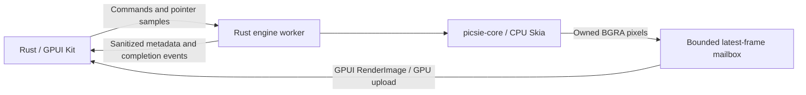
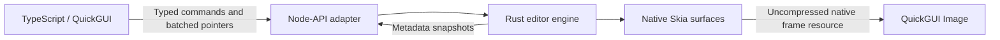

# Rust engine, native desktop UIs

Accepted user requirement, 2026-09-23. Implemented for the existing editor features. This does not imply full Compositor feature parity.

On 2026-09-29, after the successful experiment, the user authorized building a
**Rust UI / GPUI Kit application with parity against the QuickGUI UI**. It lives in
`crates/picsie-desktop`, calls the existing Rust engine directly, and has its own
Cargo workspace and pinned toolkit lockfile. The desktop UI owns only presentation,
forms, native dialogs, and input mapping; its engine worker owns editor state and
all image/file work. The TypeScript rules below continue to govern the retained
QuickGUI application. See [the experiment report](gpui-kit-experiment.md) and
[the parity record](gpui-ui-parity.md).

On 2026-09-30 the user authorized making this the default application. `npm run dev`
launches Rust / GPUI Kit; `npm run build` packages its native binary. Default checks
and tests include the desktop crate. Releases build native Linux/Windows installers
and portable archives. `dev:quickgui` and `build:quickgui` preserve the explicit
parity reference; the native app has no QuickGUI, JavaScript, or Node-API runtime.

On 2026-09-30 the user explicitly requested following **Compositor's UI** before
adding more features. The pinned SwiftUI/AppKit sources now guide the native
shell, tool bars and Layers panel. QuickGUI remains a historical migration and
performance comparison, not the current layout target. GPUI Kit remains the UI
toolkit. Unsupported Compositor controls are omitted rather than given invented
behavior; platform adaptations are recorded in [the UI record](gpui-ui-parity.md).

The desktop's pinned GPUI Linux backend includes a local implementation of X11
frame waking, so a completed preview can request the normal toolkit draw without
waiting for its periodic monitor timer. The timer and GPU presentation settings
retain their original values. The small patch and Apache-2.0 source attribution
are recorded in [the backend source record](../crates/picsie-desktop/vendor/gpui-pre-linux/PICSIE.md).
This changes presentation scheduling; editor semantics and the Rust engine
boundary remain the same.

## Ownership

| Responsibility                                                                  | Implementation         |
| ------------------------------------------------------------------------------- | ---------------------- |
| GPUI Kit views, controls, dialogs, shortcuts, transient forms and focus         | Rust desktop UI        |
| QuickGUI views, controls, dialogs, shortcuts, accessibility, display formatting | TypeScript             |
| QuickGUI transient forms, focus and open panels                                 | TypeScript             |
| Native loading, generated types, batched input, metadata subscriptions          | Thin TypeScript bridge |
| Documents, layers, masks, selection, edit transactions, undo/redo               | Rust                   |
| Document geometry, transforms, brushes, filters, compositing, pixel caches      | Rust                   |
| Image codecs, project validation, imports, atomic saves, exports                | Rust                   |

Rust is authoritative. The UI receives metadata with image contents and brush point arrays removed. It cannot set assets or strokes through a property patch. Opening a picker belongs to the UI; decoding the selected file belongs to Rust. Canvas-size form calculations remain transient UI state; Rust validates and applies the actual resize. `@napi-rs/canvas` is a development dependency used only for independent pixel checks and icon tooling.

## Runtime boundary

The default application:


```mermaid
flowchart LR
    UI[Rust / GPUI Kit] -->|Commands and pointer samples| Worker[Rust engine worker]
    Worker --> Core[picsie-core / CPU Skia]
    Worker -->|Sanitized metadata and completion events| UI
    Core -->|Owned BGRA pixels| Mailbox[Bounded latest-frame mailbox]
    Mailbox -->|GPUI RenderImage / GPU upload| UI
```

The worker executes commands in order, retaining all pointer samples and file
results. Only preview delivery coalesces. A bounded notification channel wakes
the UI when a frame or result is ready; there is no idle polling. The UI owns the
presented GPUI image and evicts retired atlas entries. No preview files or encoded
image transport are used. Compositing and brushes remain CPU Skia.

Canvas hover receives a small Rust `CursorMap` containing handle centers, guide
positions, pickable bounds and brush diameter. The desktop asks that Rust geometry
for pointer feedback and paints the brush outline as a UI overlay, without an
engine command or raster render for each hover. Text caret visibility crosses as
a typed presentation command while Rust retains glyph/caret geometry. Image and
mask thumbnails remain Rust-owned BGRA resources in the existing mailbox; view
preferences contain no document pixels or authoritative edit state.

The retained QuickGUI reference:


```mermaid
flowchart LR
    UI[TypeScript / QuickGUI] -->|Typed commands and batched pointers| Bridge[Node-API adapter]
    Bridge --> Core[Rust editor engine]
    Core -->|Metadata snapshots| Bridge
    Core --> Skia[Native Skia surfaces]
    Skia -->|Uncompressed native frame resource| Image[QuickGUI Image]
```

`crates/picsie-core` has no dependency on JavaScript or QuickGUI. `crates/picsie-native` owns one engine per window and exposes Node-API through napi-rs. The addon is tested in Node and Bun. A static CommonJS loader lets Bun embed it in the packaged executable; no working-directory dependency or external JS engine fallback exists.

Rust model/command types generate `src/engine/types.ts` through `ts-rs`. napi-rs generates `native-api.d.ts`, including async return contracts declared on the Rust exports. Regenerate with `npm run build:native`; do not hand-edit these files. Pointer moves are batched for up to 8 ms; down/up/cancel and subsequent commands flush queued samples. Each completed editing gesture commits one Rust history transaction. History captures pixel-selection coverage and feather alongside document state; immutable coverage buffers are shared and counted once against the retained-history budget. Pixel selections remain session-only and are not serialized in the supported project formats.

Rendering, image import, canvas resize, file parsing, saves, exports and color sampling run in Node-API worker tasks. A save carries its captured revision, so later edits remain dirty. Imports reject a changed document revision instead of applying stale decoded results. Closing a window releases its native owner, rejects outstanding results, and frees surfaces and frame resources after the last worker finishes. No image bytes or per-pixel calls cross JavaScript.

## QuickGUI reference preview transport and its limits

QuickGUI 0.1.6's public `Image` node accepts an image source string. Its raw `ImageSource` API is for native window/system icons, not the canvas view, and the extension ABI has no public shared-texture primitive. The current integration therefore publishes **32-bit uncompressed TIFF frame buffers from Rust**, then sends only the path to QuickGUI's native image loader.

On Linux the private temporary directory uses `/dev/shm` when available; other systems use their temporary directory. Up to eight recent frame resources are retained per window and deleted on close. Each resource has a unique path, avoiding stale native image caches. Preview backgrounds are opaque; PNG exports still preserve transparency.

This is not zero-copy GPU sharing. Skia reads pixels into a native buffer, the resource is written, and QuickGUI loads/uploads it. There is no PNG compression, base64, or JS pixel-array handoff in this path. At 936×734 a frame occupies 2,748,096 pixel bytes, plus a small TIFF header. This is a compatibility integration with a real native copy cost; replacing it with a future QuickGUI shared-texture API remains a performance improvement, not permission to add a JS renderer. No end-to-end speedup is claimed without benchmarking.

QuickGUI decodes image paths asynchronously and paints nothing while a load is in flight, so a single `Image` node blanks the canvas on every frame swap. The UI therefore keeps the last few frames stacked in `src/ui/shell.tsx`: the last decoded frame shows through until the next finishes loading, and older nodes retire after 500 ms. This adds no latency and hides the per-frame decode gap; it does not remove the copy cost above. The long-term update-in-place options — including the open-source QuickGUI core patch path — are analyzed in [the preview transport deep dive](preview-transport.md).

## Layout and compatibility

```text
crates/picsie-desktop/     Default Rust UI, engine worker and memory preview transport
scripts/desktop.mjs       Default launch, build and native packaging
app.tsx                       QuickGUI startup and window lifecycle
src/ui/                       UI and transient form state
src/engine/                   Native loader, generated types, command adapter
crates/picsie-core/        Model, commands, geometry, history, rendering, files
crates/picsie-native/      Node-API ownership and worker tasks
crates/picsie-core/tests/  Rust behavior and pinned Compositor fixtures
tests/                        Actual-addon integration and old project fixtures
```

`src/core/` has been removed. There are **zero legacy TypeScript engine exemptions**. New projects use `.picsie` files and the `picsie` format marker. Existing `.electropic` v1 projects remain readable and writable, retaining their original marker when saved. Their vector stroke masks and embedded PNG assets are preserved internally in Rust for compatibility. New masks use Rust-owned grayscale assets, and the Rust package adapter reads/writes the supported `.comp` raster/folder/mask/text/guide subset. New brush strokes follow the upstream software coverage path and retain immutable native images; they do not encode PNGs during painting or preview. Folder raster masks and live mask links round-trip through both formats. Tip rasterization, contiguous mask publication, GPU brush coverage, and richer `.comp` features remain fidelity work; see [the source map](compositor-port.md).

## Enforcement

`npm run check:architecture` restricts production JS/TS to the UI and bridge, rejects engine/pixel dependencies, pixel APIs, binary UI storage, imports from tooling/tests, and computed module imports. The policy contains no legacy imports, pixel snippets or frozen engine exemptions. Never add an exemption or JS fallback to implement an engine feature.

Dev/build/test entry points run the guard. CI checks and tests the native desktop,
packages it, and exercises the extracted Linux installer through real window
input. It also builds the reference Rust addon, checks TypeScript, and runs the
architecture suite, Rust behavior tests, and real-addon tests under Node and Bun.
Build on the target OS/architecture; only the native Linux x64 package has been
exercised here. Native releases do not use QuickGUI's updater or packaging.

The guard is structural lint, not a semantic proof. Review must identify the Rust implementation, pinned upstream source/fixtures, command boundary and resource owner. Reject engine logic hidden in a UI file. UI changes require inspecting actual native screenshots, especially alignment.


The 2026-09-30 feature pass keeps the same boundary: clipboard copy/cut rendering,
paste decoding, floating selection transforms, magic wand, layer merging and Image
Size execute in the Rust desktop worker. PNG bytes appear only in the native system
clipboard exchange; previews still use uncompressed BGRA memory. Pixel-selection
outlines and floating assets stay in Rust. New bridge contracts are generated from
Rust; the retained Node addon offers asynchronous raster command execution without
exposing image buffers to JavaScript. See the corresponding source-map section for
upstream fixtures, native controls and remaining adaptations.


Document guides, snapping targets and text layout now live in Rust. Native text
input still belongs to GPUI Kit: a caret-positioned input owns typing, IME and
local undo, while typed text/selection/navigation commands drive Rust drafts and
SkParagraph glyph geometry. Rust paints the in-canvas glyphs, caret, selection,
handles, guides and grid. Small cached ruler BGRA resources travel alongside
layer thumbnails; no new encoded preview path or JavaScript engine was added.

The retained QuickGUI text-content/property commands adapt to the same Rust text
draft and commit transaction; this preserves its controls without a second text
engine. New desktop text operations use the typed worker commands directly.

The layers/masks/color pass keeps palette state, visibility swipe transactions,
thumbnail coverage selections, mask copy/placement/distortion and all blend
algorithms in Rust. Blend hover previews use a document clone for presentation;
exports and project saves retain the committed document. The desktop worker
samples the displayed composite into a one-pixel Skia surface; only a hex color
and small metadata return to the UI. The floating picker owns its working HSB
form, target identity and position, while OK applies a typed engine command.
No image pixels or mask grids cross into JavaScript. New addon raster selection,
distortion, placement and background-fill commands execute asynchronously.

Selection feedback now travels to the native UI as immutable Rust path and
flattened-contour resources, separate from serialized metadata and canvas-sized
coverage. GPUI paints cached vector marching ants on source 120 ms timer ticks;
those ticks submit no edit command and request no engine raster preview. Exact
winding-path hit testing and dash geometry stay in Rust. QuickGUI keeps a static
outline through the existing preview path. Typed transform fields, ratio/AA
settings, image distortion and layer-pixel selection commands use the same
Rust-owned model/history; addon raster commands execute asynchronously. Expanded
crop previews composite retained artwork into a viewport-sized native surface.
No pixel arrays or new encoded preview transport cross the TypeScript boundary.

Checks and Linux release builds use GitHub-hosted `ubuntu-latest`; Windows uses
`windows-latest`. Existing-tag release retries use `workflow_dispatch` on main
with an explicit version tag, package that tag's contents, and keep the tag fixed.


The 2026-10-01 performance pass ports Compositor's flat immutable raster
snapshots for image painting and selection fill/clear. Original source pixels
and unchanged replacement patches are shared; pointer-up commits those resources
without flattening the image. PNG assets memoize an owned decoded raster instead
of depending on Skia's global decoder cache to retain the source between draws.
History accounts for the retained native resources once across shared snapshots.

Simple integer-position stacks with raster patches use retained padded
document-space pieces for previews; source thumbnails have an independent cache
of layer-local pieces, placed on the canvas after sampling. Moving a layer
retains these source pixels and source-edge antialiasing. Ordinary images retain
the existing compositor, which seeds unchanged preview pieces on the first patch
edit. Undo to the ordinary source retains eligible preview pieces for the next
edit; damage is compared with their recorded document before reuse.
Replaced/deleted layer sets and unsupported scenes release them. Patched-image
moves invalidate their old/new bounds rather than the entire piece cache. The
pieces preserve neighboring samples at seams; each cache is bounded to the
existing 24 MP pixel budget. Filters, transforms, masks and clipping
relationships keep their established rendering path. Native mask-stroke
publication still uses contiguous grayscale pixels. Full output and persistence
remain explicit consumers of complete images.

The desktop worker yields to presentation after 8 ms **between requests** (or
4,096 requests), preserving every ordered pointer sample and file completion.
A single expensive command is not preempted. The latest-frame mailbox still
prevents rendering repeatedly for a consumer that has not taken its frame.
CPU Skia processing and GPUI GPU upload/presentation retain their existing roles.
See the sixth performance pass for repeated measurements and limits; these
changes do not establish complete GIMP or Compositor performance parity.

Feathered selection coverage now blurs only the four-sigma padded selection
region and reads Alpha8 directly, retaining the same complete Rust-owned mask
contract for brush, fill/clear and history consumers. Explicit empty selections,
canvas-edge clamping and combined selections keep their established semantics.

### Indexed layer queries and retained clipping projection

The 2026-10-01 stress investigation identified per-option document cloning,
whole-graph validation repeated for every row, and full-document clipping scratch
images as structural costs. `LayerIndex` now borrows one authoritative document,
indexes IDs and sibling order, and computes the live-mask forest and incoming
chain depths once per snapshot/render. Candidate checks follow only a bounded
source chain and retain Compositor's 256-node limit, including target dependents.
Invalid graph replacement queries use the compact records without copying pixels.

The renderer addresses source caches by ID and retains shared-alpha clipping
nodes by immutable source identity, appearance and effective folder opacity.
Scratch images cover the base footprint intersected with the document, preserving
existing document-edge blur semantics. Independent mask coverage covers only the
current drawing region. Source and clipping caches each have a 24-million-pixel
LRU budget; the existing retained document composite remains separate. This is
not a multiresolution projection pyramid. Reorder damage follows changed relative
order and both old/new folder and mask dependencies, then redraws the overlapping
stack inside fixed 256-pixel document-grid chunks intersecting conservative damage.
Fixed chunk clips preserve Skia sampling phase on both initial and partial redraws. Sampling defaults remain High.
The GPUI layer list lazily builds visible 52-point rows through `uniform_list`;
selection, menus, rename, clipping, visibility swipes and drag autoscroll retain
the existing commands and scroll handle. Read-only desktop metadata indexes IDs.

Tests compare the new bounded renderer with a frozen pre-rewrite pixel oracle:
transformed/blurred scratch origins allow at most one premultiplied channel step
of Skia rounding. Straight-alpha RGB differences at low alpha can be larger.
Retained damage is checked byte-for-byte against a fresh new render. Existing
translated Compositor soft-alpha, hidden-source, chain and clipping-edit fixtures
remain authoritative. Measurements and native evidence live in
[the performance record](desktop-gimp-experiments.md).

Projection chunks retain sparse premultiplied backdrop checkpoints every 64
atomic compositing nodes plus a checkpoint before their final eight nodes. Old/new dependency closure and ordered
node comparison establish the reusable prefix; only the changed suffix is replayed.
Clipping stacks remain atomic, and hidden/live sources above a prefix invalidate
lower consumers. Empty spans share immutable checkpoint images; unique checkpoint storage is
bounded by 24 million pixels, with older images evicted before a chunk's newest. Checkpoint publication/copying
stays in Rust; no new transport format, blend math or source sampling is introduced.
Local cross-chunk/prefix tests compare every byte with fresh rendering and check
cache reuse and external-source invalidation. Earlier-prefix edits still require
replaying the lower stack; visible-priority scheduling and a pyramid remain gaps.
