# Native interaction checks

These captures come from the packaged Linux QuickGUI application, driven with pointer and keyboard events on an isolated X11 display. The environment used Xvfb, Mesa software Vulkan, and the GTK desktop portal for native file dialogs. They are actual window captures.

The final layout uses shared SVG icons, centered button content, explicit text line heights, equally sized input columns, and fixed-height layer rows. Select popups declare their own colors, row sizing, and placement. Fields reserve their label and input height so dialog buttons stay inside the popup.

## Editor and inspector

### Layer management, transform handles, and masks

The next feature pass was checked in the packaged native app with real pointer and keyboard input:

| Interaction                               | Result                                                                      |
| ----------------------------------------- | --------------------------------------------------------------------------- |
| Shift-click adjacent layer rows           | Both circles are selected; individual outlines and a shared boundary appear |
| Ctrl-click nonadjacent rows               | Individual layers join or leave the selection                               |
| Arrow / Shift+Arrow with Move focused     | Selected layers move together by 1 / 10 pixels                              |
| Drag a selected circle                    | Both layers move by the same distance                                       |
| Duplicate the selection, then undo        | Both copies appear in order; one undo removes the pair                      |
| Drag the selection's grip above the title | Insertion line appears; both layers move together in the stack              |
| Drag the right edge of the coral circle   | Width changes while the opposite edge stays anchored                        |
| Drag the rotation handle with Shift       | Layer rotates to 45°; inspector confirms the angle                          |
| Add a mask and paint Hide, then Reveal    | Blue pixels disappear and return without changing the layer content         |
| Disable and enable the mask               | Original content returns; enabling restores the painted mask                |
| Save, export PNG, and reopen              | Both mask stroke modes and the resized, rotated layer persist               |
| Resize to 960 × 640                       | Mask toolbar, inspector fields, and actions remain aligned                  |

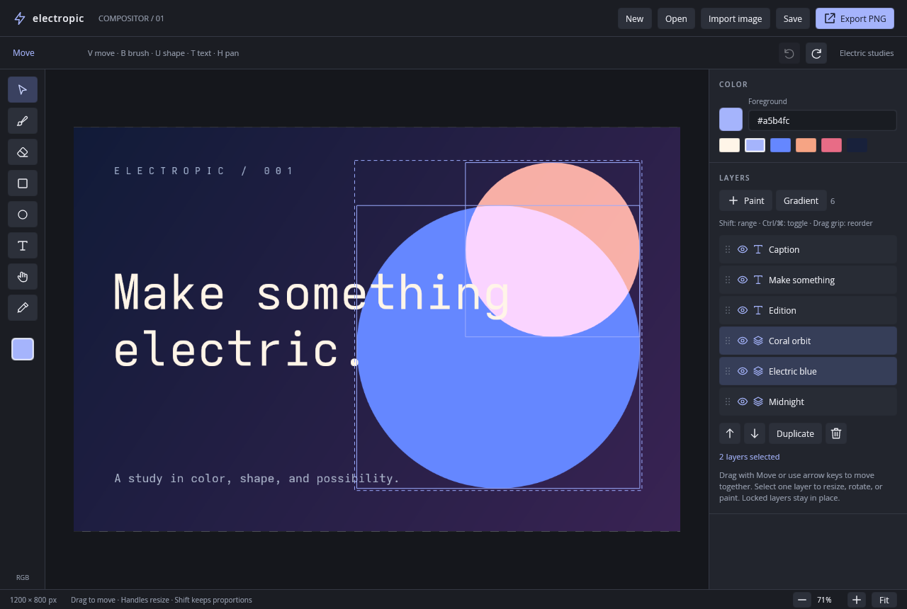

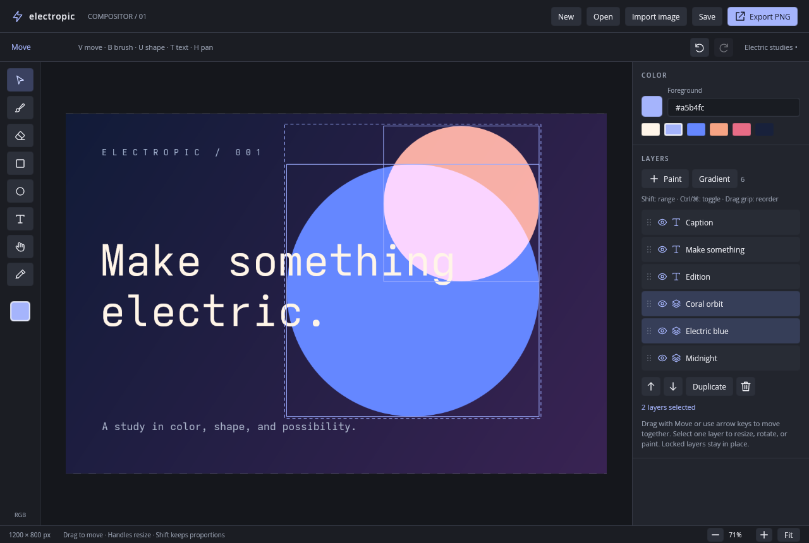

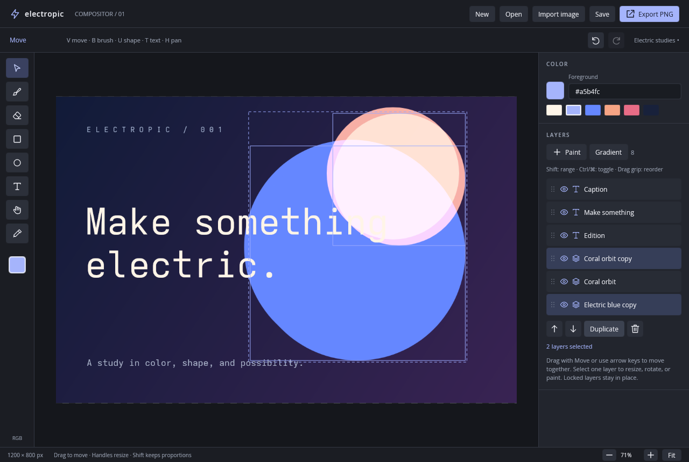

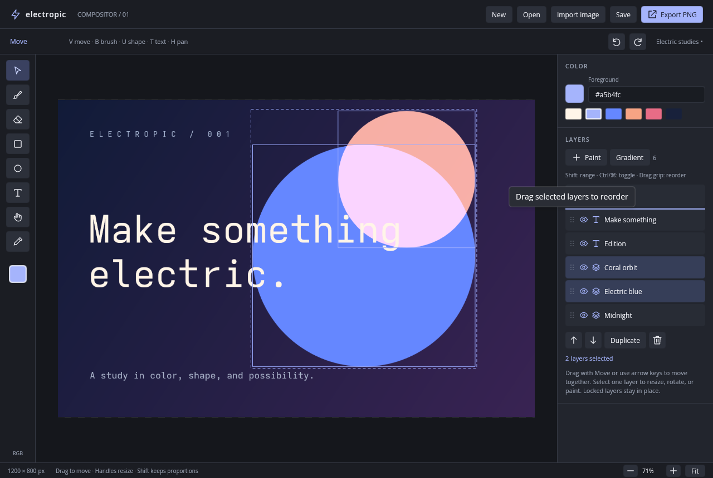

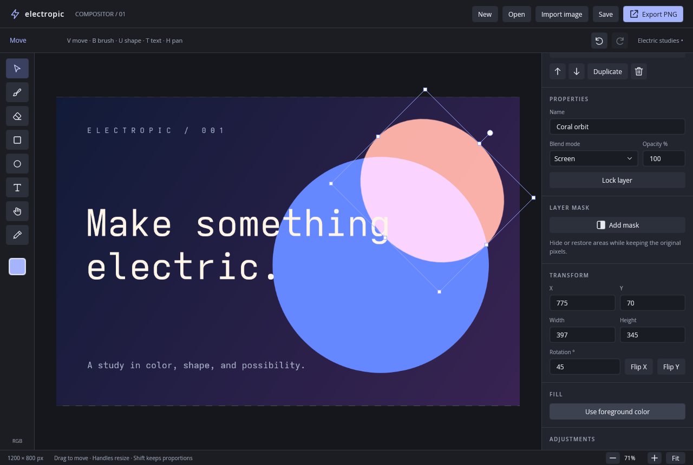

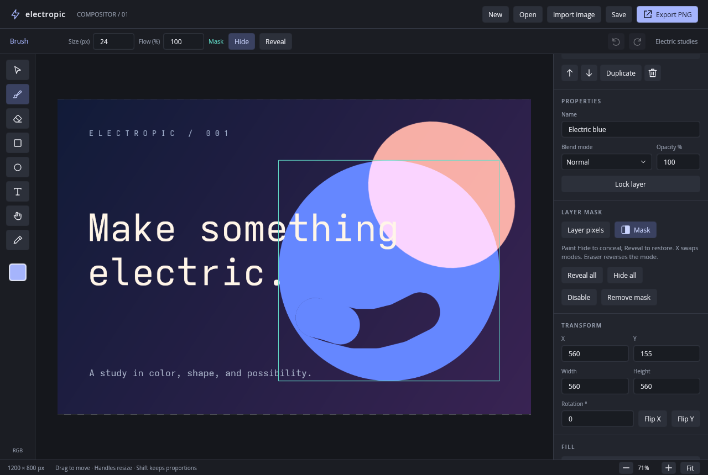

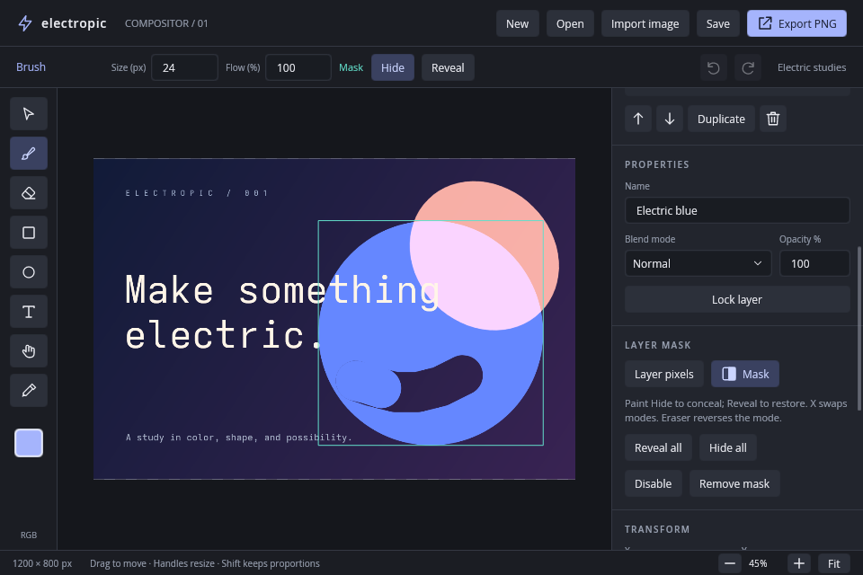

The latest saved test document is `artifacts/editing-session.electropic`. Its exported `artifacts/editing-session.png` matches a fresh compositor render byte for byte. It contains six layers, an enabled mask with Hide and Reveal strokes, and a coral layer rotated 45° with its horizontal scale changed by an edge drag.

Core tests cover every resize handle across rotations and flips, aspect preservation, rotation snapping, range and individual selection, group ordering/movement/duplication, locked layers, mask alpha and restoration, cache invalidation, undo/cancel, save/reopen, and old projects without masks. Group resize/rotation and automatic scrolling during a layer drag remain outside this implementation.

### Earlier alignment pass

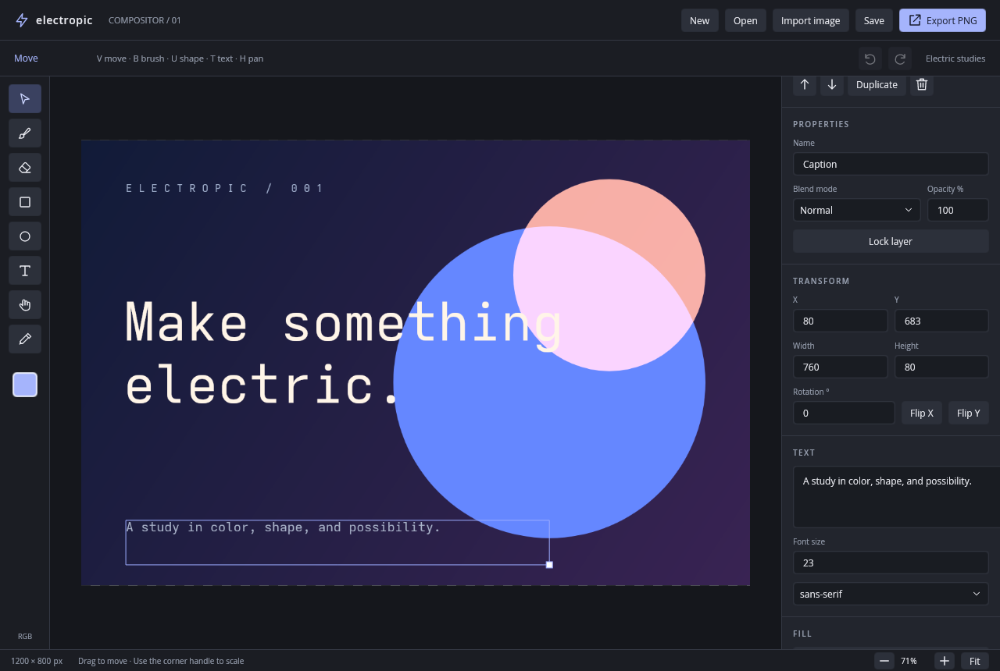

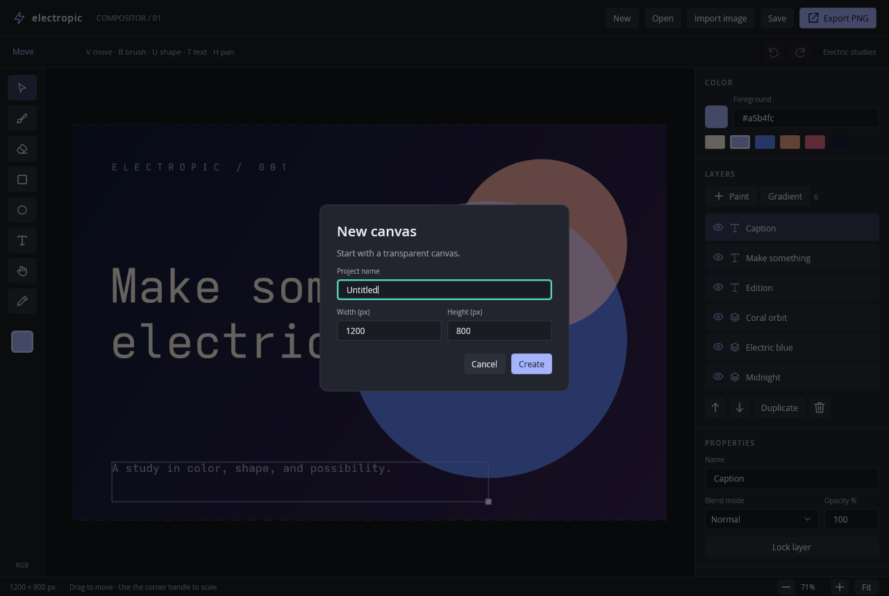

## Interactive smoke test

| Interaction                           | Result                                                            |
| ------------------------------------- | ----------------------------------------------------------------- |
| Drag and resize a layer               | Composition and selection bounds update                           |
| Set opacity to 65%                    | Layer becomes translucent                                         |
| Draw an ellipse and brush stroke      | New content renders in the composition                            |
| Erase a stroke, then undo             | Underlying layers stay intact; undo restores the stroke           |
| Enter text and set size to 28         | Complete `NATIVE / QUICKGUI` string persists in the saved project |
| Open blend picker and choose Multiply | Popup renders and the layer changes blend mode                    |
| Resize to 960 × 640 and Fit           | Toolbar remains aligned; entire composition fits the viewport     |
| Open New canvas                       | Labels, inputs, and action buttons stay inside the dialog         |
| Save and reopen `.electropic`         | Seven layers and edited text are restored in a new window         |
| Export PNG through the file dialog    | Export matches rendering the saved project byte for byte          |

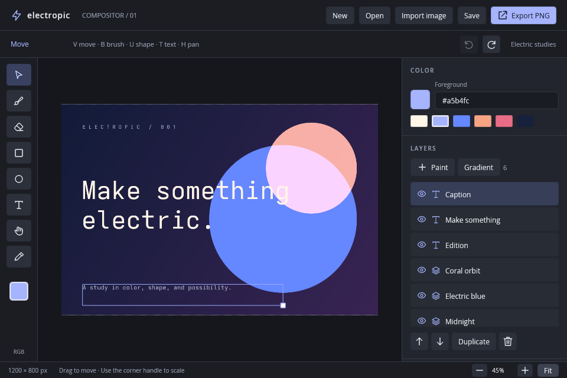

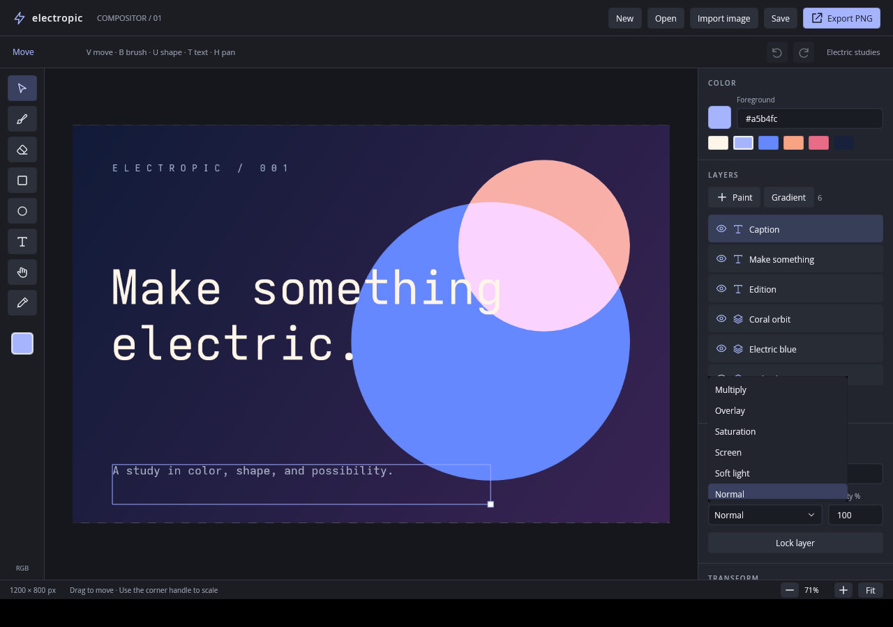

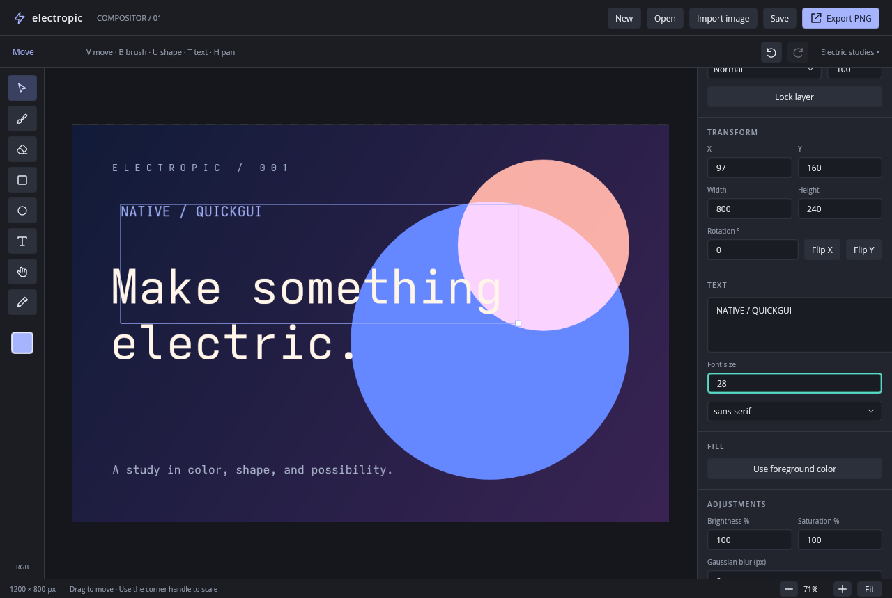

The screenshots record successive checks during the alignment pass; the editor, inspector, and New canvas images show the final field sizing. Generated test files and additional captures remain in ignored `artifacts/`. The project and PNG used for the persistence check are `artifacts/native-session.electropic` and `artifacts/native-session.png`.

## Automated verification

`npm run check`, `npm test`, `npm run test:quickgui`, and `npm run build` validate the TypeScript code, 48 core tests under both runtimes, and Linux packaging. Tests exercise real raster buffers, transformations, history, and project files.

This smoke test does not establish exhaustive UI or accessibility coverage. macOS execution, signing, and notarization have not been tested. Linux application menus are unsupported by QuickGUI 0.1.6, so this app provides toolbar actions and canvas keyboard shortcuts on Linux.

## Source-alignment pass

The [Compositor source map](compositor-port.md) records the pinned Swift routines and fixtures used for the follow-up port. Duplication now preserves placement exactly, so the earlier duplication screenshot records the previous 16-pixel-offset behavior. New layers insert above the active layer. Transform resizing now uses the upstream diagonal projection, handles crossing the anchor by mirroring, and supports Alt/Option center resizing. Earlier screenshots remain a record of those test sessions.

The rebuilt native app was checked with actual Alt-key and pointer input. Dragging the coral layer's right handle 40 screen pixels moved both edges outward by 40 pixels, keeping its center fixed. Duplicating it preserved its bounds exactly. Selecting the coral layer and adding a paint layer inserted the new row immediately above it, below the existing text layers. These captures were inspected for behavior and alignment.

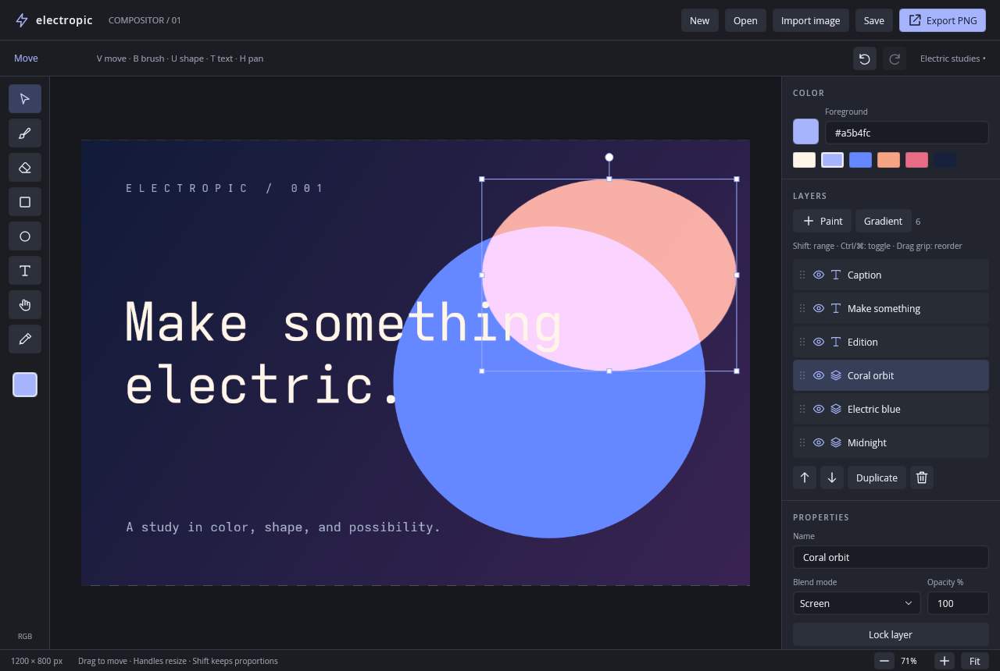

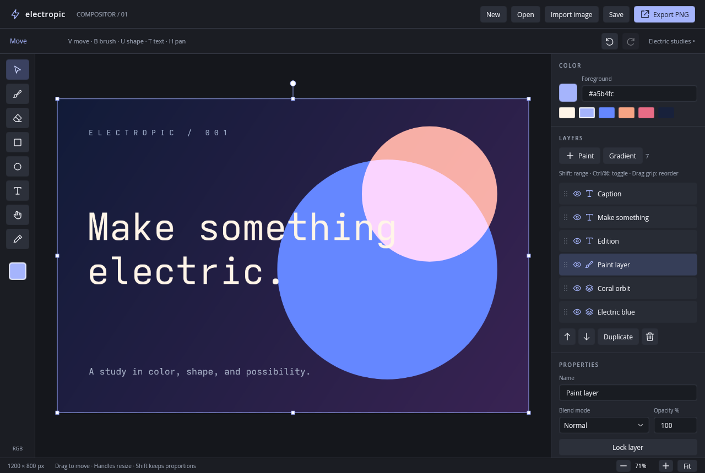

At this stage undo did not restore the previous active selection. The subsequent history port below fixes that deviation.

## Canvas Size and selection history

The packaged app was rebuilt and driven with actual pointer and keyboard input for the source-based Canvas Size/history pass:

- Opened Canvas Size through the dimensions button and Ctrl+Alt+C.
- Enabled relative dimensions and aspect-ratio lock; entering +300 width on the 1200 × 800 canvas produced 1500 × 1000, with +200 height.
- Chose the top-left anchor and white extension, then applied. White bands appeared on the right and bottom; the coral layer stayed selected. Undo restored 1200 × 800 and removed the extension; redo restored 1500 × 1000.
- Duplicated Coral orbit, selected Caption, and undid: Coral orbit became active again. Redo selected Coral orbit copy.
- Entered an invalid zero width: the dialog displayed the dimension limits and disabled Resize canvas.
- Checked the dialog at 1280 × 860 and 960 × 640. The first compact check found the extension popup clipped at the bottom; positioning it above the field fixed that. The final captures show aligned controls and all five extension choices within the window.

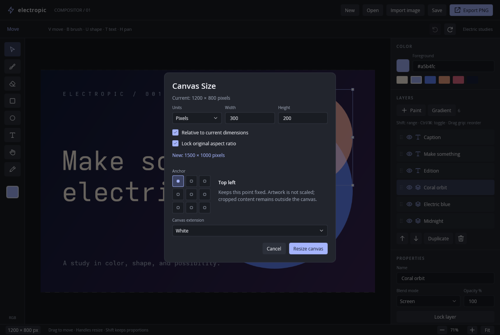

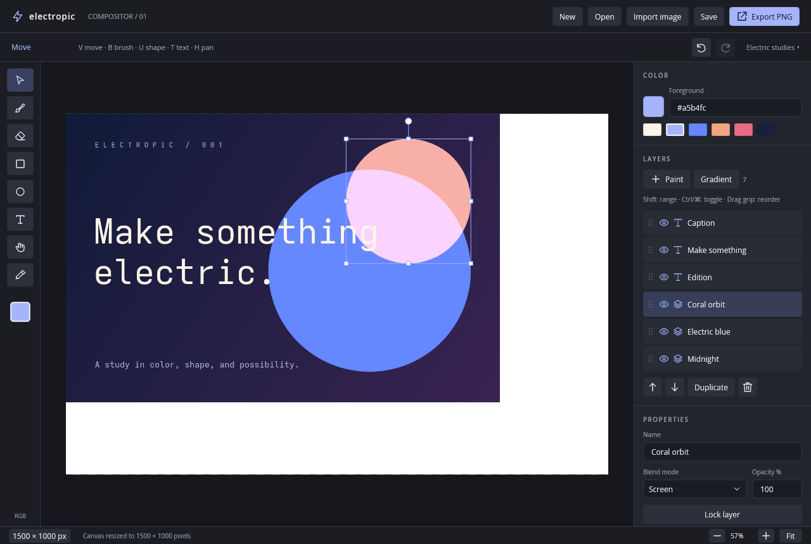

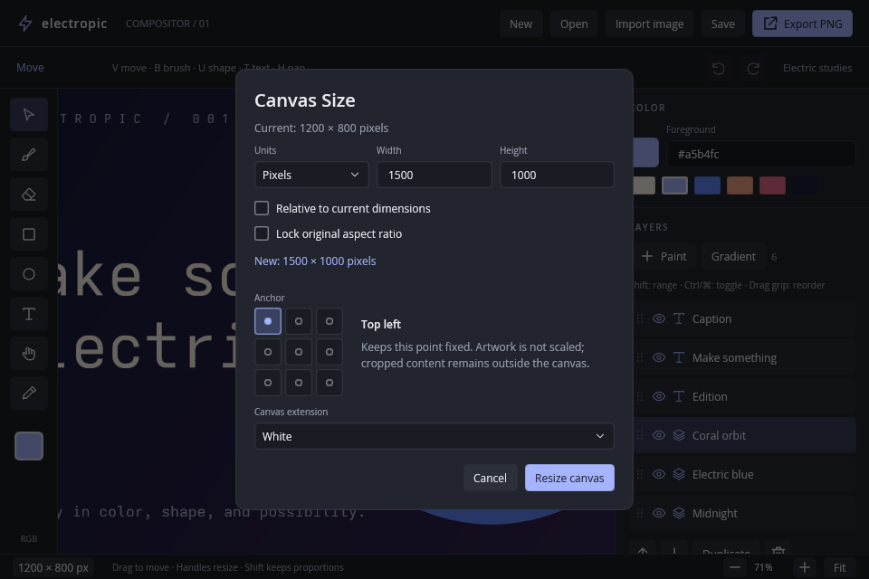

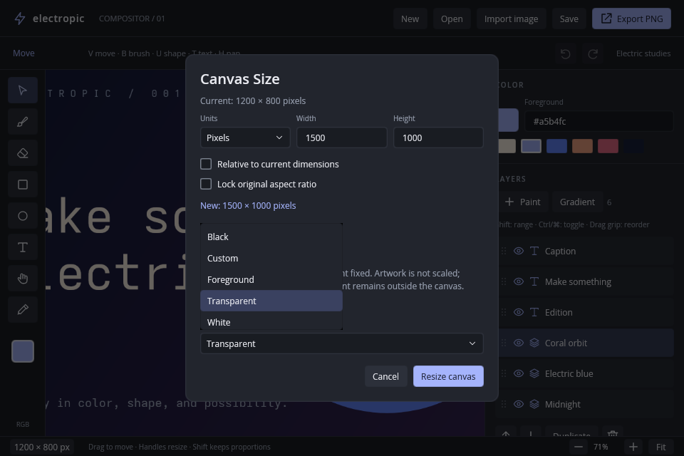

All 48 tests pass under Node and QuickGUI/Bun, including real pixel assertions for colored extensions and project save/reopen. Typechecking and Linux packaging pass. The source map identifies the translated upstream fixtures and the remaining adaptations.

## Rust migration pass — 2026-09-23

The earlier TypeScript suite has moved to 30 consolidated Rust behavior tests and 11 actual-addon integration tests under both Node and Bun. Seven architecture tests enforce the UI/native boundary, including rejecting attempts to restore legacy exceptions. `npm run check`, `npm test`, `npm run test:bun`, `npm run smoke`, and Linux packaging pass. CI has been configured but was not run remotely.

The packaged binary was exercised on the same isolated X11 display. This pass caught a bundled-addon path problem, an unsupported BMP preview format, and nearest-neighbor preview sampling. The final loader embeds the addon, native frame resources use uncompressed TIFF supported by QuickGUI, and Skia scales the preview with linear sampling. Text uses native SkParagraph shaping and the previous Canvas2D top-baseline calculation. The system font manager resolves generic family names, so text appearance can differ from the old canvas package's fallback font.

Verified in the actual window:

- Layer selection, group movement, and native undo/redo shortcuts.
- Hide and Reveal mask strokes, original-pixel preservation, and mask controls.
- Canvas resize with a white extension; layer positions and group selection survive.
- Native GTK Save and Export dialogs. Saved `artifacts/rust-session.electropic` at 1440 × 960 with seven layers and both mask strokes.
- Reopening that saved project in a second window. The PNG exported through the UI was byte-identical to a fresh Rust export of the reopened file.
- The 960 × 640 minimum window size. Screenshots were visually inspected for icon, text, row, field and dialog alignment.

Current screenshots: [editor](screenshots/rust-editor.png), [mask painting](screenshots/rust-mask.png), [group movement](screenshots/rust-group.png), [reopened project](screenshots/rust-reopened.png), [compact window](screenshots/rust-compact.png).

Unverified: macOS/Windows execution and signing, remote CI, and direct GPU texture sharing. The uncompressed native resource path still copies pixels. The later crop, raster-mask, folder, pixel-selection, and `.comp` package pass is covered by Rust and actual-addon tests; this workspace has no Xvfb or graphical display for a fresh window screenshot. The source map states the supported `.comp` subset and remaining mask deviations.

## Project picker check — 2026-09-23

QuickGUI 0.1.6 rejects a picker configured for both files and directories on Linux. The toolbar and File menu now offer separate **Open** and **Open .comp** actions. The first uses a file picker for `.picsie` and `.electropic`; the second uses a directory picker for `.comp` packages.

The rebuilt Linux app was run on an isolated X11 display with the GTK file portal. A saved `.picsie` file opened in a second editor window. A `.comp` directory saved through the UI reopened through **Open .comp**; the folder picker required entering the package directory before selecting it. At the 960 × 640 minimum size, both Open actions remained visible and aligned. See the [five-flow UX tour](ux-tour.md) for the new captures. `npm run check`, `npm test`, and `npm run build` passed.
